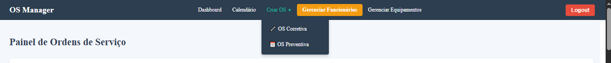

# OS Manager - Sistema de Gerenciamento de Ordens de Serviço

## 1. Visão Geral do Projeto

O **OS Manager** é uma solução web completa projetada para modernizar e otimizar o gerenciamento de Ordens de Serviço (OS) de manutenção. Ele substitui processos manuais (planilhas, comunicações informais) por uma plataforma centralizada, transparente e eficiente.

### Principais Objetivos:

- **Centralizar Solicitações**: Um único canal para abrir e acompanhar OS.
- **Rastreabilidade em Tempo Real**: Status visível a todos os envolvidos.
- **Fluxo de Trabalho Padrão**: Nenhuma etapa esquecida no processo.
- **Gestão Simplificada**: Administração intuitiva de usuários, equipamentos e locais.
- **Automação de Preventivas**: Agendamento automático baseado em planos definidos.

## 2. Tecnologias Utilizadas

### Backend (API)
- **Framework**: Spring Boot
- **Linguagem**: Java 17
- **Segurança**: Spring Security + JWT
- **Acesso a Dados**: Spring Data JPA (Hibernate)
- **Banco de Dados**: PostgreSQL
- **Build Tool**: Maven

### Frontend (Aplicação Web)
- **Framework**: React 19
- **Build Tool**: Vite
- **Roteamento**: React Router DOM
- **HTTP Requests**: Axios com JWT Interceptors
- **Componentes**: React Big Calendar
- **Estilização**: CSS modular

## 3. Funcionalidades Detalhadas

### 🛠️ Módulo de Ordens de Serviço
- Criação de OS (Corretiva ou Preventiva)
- Dashboard Interativo por status e data
- Ações rápidas no painel
- Página de detalhes com histórico e dados completos
- Registro de execução técnica com tempo e peças

### 📅 Calendário de Manutenção Preventiva
- Visualização mensal de OS preventivas
- Navegação entre períodos
- Cores por status (Aberta, Em Execução, Concluída)
- Acesso rápido aos detalhes via clique

### ⚙️ Módulo Administrativo
- **Funcionários**: CRUD com edição e exclusão "inline"
- **Equipamentos e Locais**: Cadastro e gerenciamento
- **Planos de Manutenção**: Serviços com frequência (diária, semanal etc.) + agendamento automático de próximas OS

### 🔐 Controle de Acesso e Perfis (via `TipoFuncionario`)
- **ADMIN**: Acesso total
- **ENCARREGADO**: Aprovação/verificação de OS preventivas
- **LIDER / MECANICO**: Execução de OS
- **SOLICITANTE**: Criação e acompanhamento de OS próprias

## 4. Guia de Uso: Ciclo de Vida de uma OS

| Status                  | Cor no Dashboard       | Significado                                         | Próxima Ação          |
|-------------------------|------------------------|-----------------------------------------------------|------------------------|
| **ABERTA**              | Verde (Corretiva)      | Novo chamado aguardando técnico                     | ✅ Dar Ciência         |
| **CIENTE**              | Azul                   | Técnico assumiu e está ciente                       | ▶️ Iniciar Execução   |
| **EM EXECUÇÃO**         | Amarelo                | Técnico está executando o serviço                   | 🛠️ Finalizar Execução |
| **AGUARDANDO VERIFICAÇÃO** | Laranja             | (Preventiva) Aguardando verificação de encarregado  | 🔍 Verificar OS        |
| **CONCLUÍDA**           | Cinza                  | Serviço finalizado com sucesso                      | —                      |
| **CANCELADA**           | Vermelho               | Serviço cancelado                                   | —                      |

### Fluxo Detalhado
1. **Criação**: OS com status `ABERTA`.
2. **Ciência**: Técnico assume (status `CIENTE`).
3. **Execução**: Técnico inicia (status `EM EXECUÇÃO`).
4. **Finalização**:
   - Corretiva → `CONCLUÍDA`
   - Preventiva → `AGUARDANDO VERIFICAÇÃO`
5. **Verificação** (Preventivas): ENCARREGADO aprova (`CONCLUÍDA`) ou reprova (`EM EXECUÇÃO`).
6. **Agendamento Automático**: Próxima OS criada com base na frequência definida.

## 5. Calendário de Manutenção Preventiva

- Interface exclusiva com **visualização mensal**
- Navegação por semanas/dias
- Cores por status
- Clicável: acesso direto aos detalhes da OS

## 6. Gerenciamento Inline

- Interface para **edição e exclusão de funcionários** em uma só página
- Edição inline, sem recarregamentos
- Agilidade no gerenciamento administrativo

## 7. Planos de Manutenção

- Criação de planos associando **serviço + equipamento + frequência**
- Ex: "Limpeza semanal" para compressor
- Cada OS concluída gera automaticamente a próxima OS
- Garante **ciclos contínuos de manutenção preventiva**

## 8. Guia de Instalação e Configuração

### Pré-requisitos
- Java JDK 17+
- Maven 3.x
- Node.js 20+ e npm
- PostgreSQL

### Backend
1. **Crie o banco de dados**:
   ```sql
   CREATE DATABASE osmanager;
   ```
2. **Configure o `application.properties`**:
   ```properties
   spring.datasource.username=seu_usuario
   spring.datasource.password=${DB_PASSWORD}
   ```
3. **Execute o projeto**:
   ```bash
   mvn spring-boot:run
   ```
   Acesse em: `http://localhost:8080`

> ⚠️ Na primeira execução, um ADMIN padrão será criado:  
> **Email**: `admin@empresa.com`  
> **Senha**: `senha_forte_123`

### Frontend
1. Instale as dependências:
   ```bash
   cd osmanager-frontend
   npm install
   ```
2. Execute o projeto:
   ```bash
   npm run dev
   ```
   Acesse em: `http://localhost:5173`

> 🔁 Verifique se o proxy do `vite.config.js` aponta para `http://localhost:8080`.

## 📷 Visuais do Sistema

### Tela de Criação de OS
> Interface intuitiva para abertura de chamados com seleção de tipo, equipamento e local.


### 🔄 Fluxograma do Ciclo da OS
> Representação visual do ciclo completo de vida de uma OS (Corretiva ou Preventiva).

## 📌 Licença

Este projeto é de código fechado e restrito ao uso interno da equipe de desenvolvimento da empresa. Para mais informações, entre em contato com o administrador do sistema.