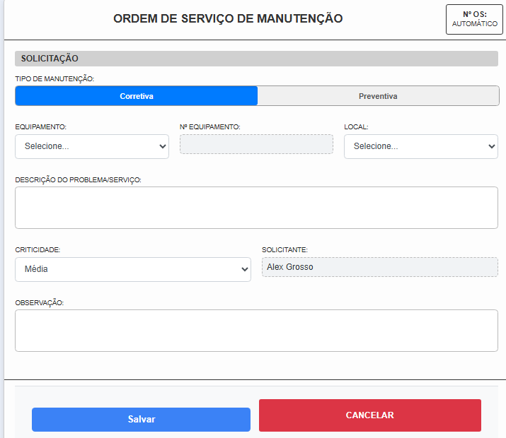
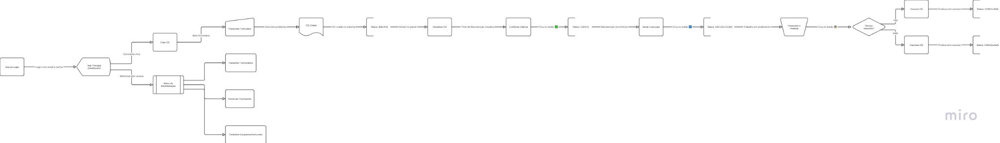
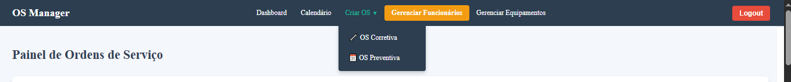

# OS Manager - Sistema de Gerenciamento de Ordens de Serviço

## 1. Visão Geral do Projeto

O **OS Manager** é uma solução web completa projetada para modernizar e otimizar o gerenciamento de Ordens de Serviço (OS) de manutenção. Ele substitui processos manuais (planilhas, comunicações informais) por uma plataforma centralizada, transparente e eficiente.

### Principais Objetivos:

-   **Centralizar Solicitações**: Um único canal para abrir e acompanhar OS.
-   **Rastreabilidade em Tempo Real**: Status visível a todos os envolvidos.
-   **Fluxo de Trabalho Padrão**: Nenhuma etapa esquecida no processo.
-   **Gestão Simplificada**: Administração intuitiva de usuários, equipamentos, setores e locais.
-   **Automação de Preventivas**: Agendamento automático baseado em planos de manutenção definidos.

## 2. Tecnologias Utilizadas

### Backend (API)

-   **Framework**: Spring Boot
-   **Linguagem**: Java 17
-   **Segurança**: Spring Security + JWT
-   **Acesso a Dados**: Spring Data JPA (Hibernate)
-   **Banco de Dados**: PostgreSQL
-   **Build Tool**: Maven

### Frontend (Aplicação Web)

-   **Framework**: React 18
-   **Build Tool**: Vite
-   **Roteamento**: React Router DOM
-   **HTTP Requests**: Axios com JWT Interceptors
-   **Componentes**: React Big Calendar, React-to-Print
-   **Estilização**: CSS modular

## 3. Funcionalidades Detalhadas

### 🛠️ Módulo de Ordens de Serviço

-   Criação unificada de OS (Corretiva e Preventiva).
-   Dashboard Interativo com filtros por status, data, equipamento, etc.
-   Ações rápidas no painel (Dar ciência, Iniciar, Executar, Verificar).
-   Página de detalhes com histórico completo e opção de impressão.
-   Registro de execução com checklist para preventivas, tempo de parada e peças utilizadas.

### 📅 Calendário de Manutenção

-   Visualização mensal de OS Corretivas e Preventivas agendadas.
-   Projeção de futuras manutenções preventivas com base na frequência.
-   Navegação entre períodos.
-   Cores por status (Previsto, Agendado, Concluído).
-   Acesso rápido aos detalhes da OS via clique no evento.

### ⚙️ Módulo Administrativo

-   **Funcionários**: CRUD completo com edição e exclusão "inline".
-   **Equipamentos**: Cadastro de equipamentos, associando os tipos de serviços aplicáveis a cada um.
-   **Serviços de Manutenção**: Catálogo centralizado de todos os serviços (ex: "Verificar nível do óleo").
-   **Frequências**: Gerenciamento de frequências de manutenção (diário, semanal, mensal, etc.).
-   **Setores e Locais**: Cadastro e gerenciamento hierárquico dos locais da fábrica.

### 🔐 Controle de Acesso e Perfis (via `TipoFuncionario`)

-   **ADMIN**: Acesso total ao sistema.
-   **ENCARREGADO**: Aprovação/reprovação de OS preventivas concluídas.
-   **LIDER / MECANICO**: Execução de Ordens de Serviço.
-   **SOLICITANTE**: Apenas criação e acompanhamento de suas próprias OS.

## 4. Visão Geral das Telas (Janelas)

O sistema é composto pelas seguintes telas principais:

### Telas Gerais

-   **Login (`/login`)**: Página inicial para autenticação de usuários.
-   **Dashboard (`/dashboard`)**: Tela principal do sistema. Exibe uma lista de todas as Ordens de Serviço, permitindo filtros avançados por status, data, equipamento, e mais. É daqui que os técnicos iniciam suas ações.
-   **Criar Ordem de Serviço (`/criar-os`)**: Formulário unificado para a criação de OS Corretivas e Preventivas. Os campos se adaptam dinamicamente ao tipo de manutenção selecionado.
-   **Visualizar Ordem de Serviço (`/os/:id`)**: Exibe todos os detalhes de uma OS específica, incluindo seu histórico completo. Também permite a impressão do documento.
-   **Calendário (`/calendario`)**: Apresenta uma visão mensal de todas as OS agendadas e previstas, com cores indicando o status e tipo, facilitando o planejamento.

### Telas Administrativas

-   **Gerenciar Funcionários (`/admin/funcionarios`)**: Menu de entrada para a gestão de usuários.
    -   **Listar Funcionários (`/admin/funcionarios/listar`)**: Tabela com todos os usuários cadastrados, permitindo edição "inline" de informações e exclusão.
    -   **Cadastrar Funcionário (`/admin/funcionarios/cadastrar`)**: Formulário para adicionar novos usuários ao sistema e atribuir seus cargos (permissões).
-   **Gerenciar Equipamentos (Menu) (`/admin/equipamentos`)**: Menu central para toda a gestão relacionada a ativos e configurações de manutenção.
    -   **Gerenciar Equipamentos (`/admin/equipamentos/gerenciar`)**: Tela para cadastrar, editar, excluir e associar serviços a cada equipamento.
    -   **Gerenciar Serviços (`/admin/equipamentos/servicos`)**: Permite criar e gerenciar um catálogo de todos os serviços de manutenção disponíveis (ex: "Limpeza de filtro", "Troca de óleo").
    -   **Gerenciar Frequências (`/admin/frequencias/gerenciar`)**: Tela para definir as periodicidades das manutenções preventivas (ex: Semanal, Mensal, Anual).
    -   **Gerenciar Setores e Locais (`/admin/locais/gerenciar`)**: Interface unificada para cadastrar e gerenciar os setores da fábrica e os locais específicos dentro de cada setor.

## 5. Guia de Uso: Ciclo de Vida de uma OS

| Status                  | Cor no Dashboard       | Significado                                         | Próxima Ação          |
|-------------------------|------------------------|-----------------------------------------------------|------------------------|
| **ABERTA** | Verde                  | Novo chamado aguardando técnico                     | ✅ Dar Ciência         |
| **PENDENTE** | Azul                   | Técnico assumiu e está ciente da OS                 | ▶️ Iniciar Execução   |
| **EM EXECUÇÃO** | Amarelo                | Técnico está executando o serviço                   | 🛠️ Finalizar Execução |
| **AGUARDANDO VERIFICAÇÃO**| Laranja                | (Preventiva) Aguardando verificação de encarregado  | 🔍 Verificar OS        |
| **CONCLUÍDA** | Cinza                  | Serviço finalizado com sucesso                      | —                      |
| **CANCELADA** | Vermelho               | Serviço cancelado                                   | —                      |

### Fluxo Detalhado
1. **Criação**: Uma OS é criada com o status `ABERTA`.
2. **Ciência**: Um técnico assume a responsabilidade, e o status muda para `PENDENTE`.
3. **Execução**: O técnico inicia o trabalho, e o status muda para `EM EXECUÇÃO`.
4. **Finalização**:
   - Se for **Corretiva**, o status vai para `CONCLUÍDA`.
   - Se for **Preventiva**, o status muda para `AGUARDANDO VERIFICAÇÃO`.
5. **Verificação** (apenas para Preventivas): Um ENCARREGADO aprova (status `CONCLUÍDA`) ou reprova (status volta para `EM EXECUÇÃO`).
6. **Agendamento Automático**: Ao concluir uma OS Preventiva, o sistema automaticamente cria a próxima OS com base na frequência definida.

## 6. Guia de Instalação e Configuração

### Pré-requisitos
- Java JDK 17+
- Maven 3.x
- Node.js 20+ e npm
- PostgreSQL

### Backend
1. **Crie o banco de dados**:
   ```sql
   CREATE DATABASE osmanager;
   ```
2. **Configure o `application.properties`**:
   ```properties
   spring.datasource.username=seu_usuario
   spring.datasource.password=${DB_PASSWORD}
   ```
3. **Execute o projeto**:
   ```bash
   mvn spring-boot:run
   ```
   Acesse em: `http://localhost:8080`

> ⚠️ Na primeira execução, um usuário **ADMIN** padrão será criado:  
> **Email**: `admin@empresa.com`  
> **Senha**: `senha_forte_123`

### Frontend
1. Instale as dependências:
   ```bash
   cd osmanager-frontend
   npm install
   ```
2. Execute o projeto:
   ```bash
   npm run dev
   ```
   Acesse em: `http://localhost:5173`

> 🔁 Verifique se o proxy no arquivo `vite.config.js` está apontando para o endereço correto do seu backend (ex: `http://localhost:8080`).

## 7. Visuais do Sistema

### 🛠️ Criar uma Ordem de Serviço


### 🔄 Fluxograma da Ordem de Serviço


### 📌 Barra de Navegação do Sistema


## 8. Licença

Este projeto é de código fechado e restrito ao uso interno da equipe de desenvolvimento da empresa. Para mais informações, entre em contato com o administrador do sistema.
